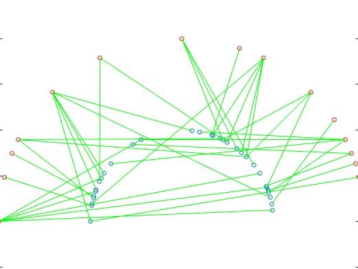

Models of Orientation Tuning (BUILDING IN PROGRESS)

# Overview

Units in primary visual cortex are tuned to the orientation of a stimulus that lands on their spatial receptive fields. An open question in visual neuroscience is how such units aquire their tuning. One classical idea - inspired by the work of Hubel and Weisel (1962) -  asserts that untuned, slightly spatially displaced ON and OFF signals converge onto common V1 unit target, endowing the unit with orientation tuning. This project is intended to play around and test this model.

<u>Quick Links</u>

- Notes and basic concepts of models can be found [here](README_tuning_models)
- See ***Linearity Section*** from [notes on spectral analysis](/Users/luis/Box/boxNOTES/ntsSPECTRAL)
- See  notes on types of Visual Models [here](/Users/luis/Box/boxNOTES/ntsMODELS) and [here](README_models) 
- Code for the analys can be found [here](dipCODE/) 
- Data can be found here()

## Miscenallenous 

This report requires some basic knowledge in visual neuroscience. You can look at these references for a start [1](prjALEX/TEACH.md)

 

 

